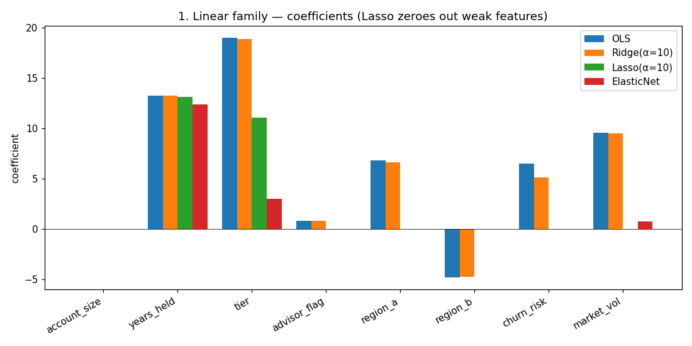
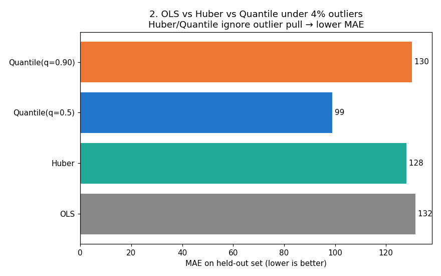
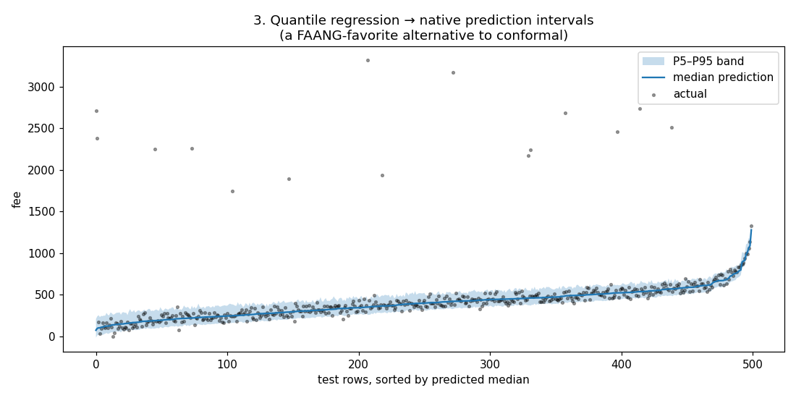
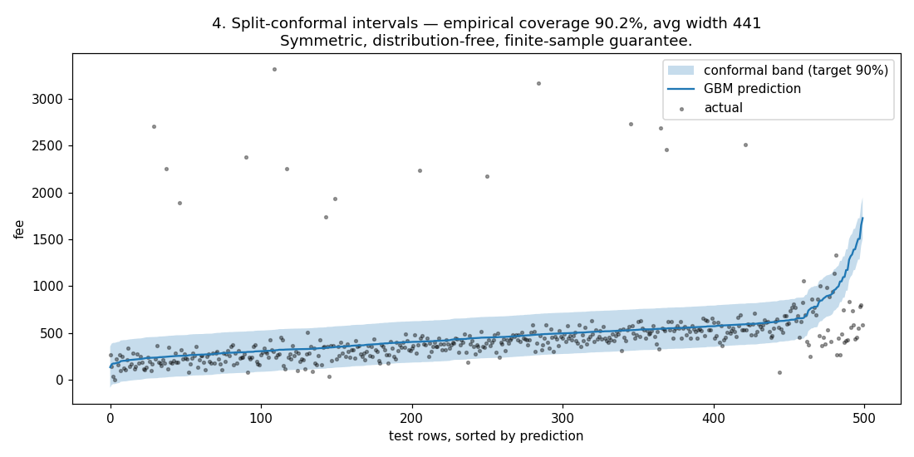
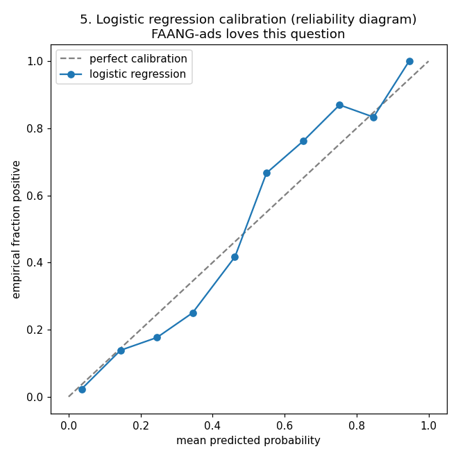
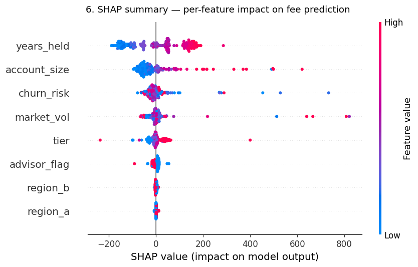

# FAANG MLE Curriculum

Carved subgraph of 106 concepts from the 2,081-node graph, targeted at
Classic MLE (ranking / reco / ads / search). Each lesson: runnable Python
+ plots rendered inline below so the whole thing reads on a phone.

---

## Run locally

**The 3D knowledge-graph app** (from the repo root):
```bash
python3 -m http.server 8000
# open http://localhost:8000
```

**A lesson** (produces the PNGs in its `plots/` folder):
```bash
pip install scikit-learn numpy pandas matplotlib shap
python3 lessons/01_regression/regression_lesson.py
```

---

## Lesson 01 — Regression family

Graph nodes covered: **OLS, Ridge, Lasso, Elastic Net, Huber Regression,
Quantile Regression, Logistic Regression** — plus **SHAP** and
**split conformal** (conformal isn't a graph node yet; added for
Purefacts-style regulated work).

### 1. Coefficient shrinkage — OLS vs Ridge vs Lasso vs Elastic Net


Same squared-error objective, different penalty. Lasso's L1 term zeroes out
weak coefficients — feature selection for free. Ridge's L2 shrinks everything
smoothly — stable with correlated features. Elastic Net mixes both.

### 2. Robustness when outliers exist (Purefacts fee re-bills)


4% of fees have op errors. OLS squares the error so outliers dominate the
fit. Huber switches from quadratic to linear past a threshold. Quantile
minimises the median (q=0.5) or any quantile. MAE numbers from the run:

| Model | MAE |
|---|---|
| OLS | 132 |
| Huber | 128 |
| Quantile (median) | **99** |

### 3. Quantile regression → native prediction intervals


Fit one model per quantile (0.05, 0.5, 0.95). Instant P5–P95 band. No
bootstrap. Asymmetric bands when the error distribution is skewed.

### 4. Split conformal prediction — distribution-free guarantees


Algorithm:
1. Train any model on a train split.
2. Compute |y − ŷ| on a held-out calibration split.
3. Take the 90th percentile of those residuals → `q`.
4. For any new prediction ŷ, the band `[ŷ−q, ŷ+q]` has ≥ 90 % coverage —
   no distributional assumptions, finite-sample guarantee.

Empirical result from this run: **90.2 % coverage**, avg band width 441.
This is the single most undersold technique in regulated finance ML.

### 5. Logistic calibration — ads-style reliability diagram


Logistic probabilities are usually well-calibrated out of the box;
tree ensembles are not (and need Platt or Isotonic). FAANG ads/CTR
asks this in every onsite.

### 6. SHAP — per-row, additive feature attributions


Each dot = one test row × one feature. Horizontal axis = push on the
prediction. Colour = feature value. Replaces generic "feature importance"
with game-theoretic Shapley values.

---

## Curriculum roadmap

| # | Lesson | Graph nodes |
|---|---|---|
| 01 | Regression family ✅ | OLS, Ridge, Lasso, Elastic Net, Huber, Quantile, Logistic, SHAP, + conformal |
| 02 | Probability & expectations | probability, expectation, variance, Bernoulli, Normal, MLE, KL, cross-entropy |
| 03 | Trees & boosting | CART, Random Forest, Gradient Boosting, XGBoost, LightGBM, CatBoost |
| 04 | Optimization | GD, SGD, momentum, AdaGrad, RMSProp, Adam, AdamW, backprop |
| 05 | Neural nets from scratch | perceptron, MLP, activations, dropout, batch/layer norm, softmax |
| 06 | Sequence models | RNN, LSTM, GRU, seq2seq, Bahdanau/Luong attention |
| 07 | Transformers | Transformer, BERT, GPT, T5, ViT |
| 08 | Embeddings + retrieval | TF-IDF, BM25, word2vec, GloVe, FastText, Sentence-BERT, LSH |
| 09 | Matrix-factorisation reco | MF, ALS, SVD++, FM, NCF |
| 10 | Deep reco | Wide & Deep, DeepFM, DIN, DIEN |
| 11 | Two-tower & retrieval reco | DSSM, Two-Tower, ColBERT, Poly/Cross-Encoder |
| 12 | Learning to rank | RankNet, LambdaRank, LambdaMART, ListNet, ListMLE, BPR |
| 13 | Sequential reco | SASRec, BERT4Rec, GRU4Rec |
| 14 | Training at scale | knowledge distillation, QAT, ZeRO, mixup |
| 15 | Interpretability + uncertainty | SHAP deep dive, conformal deep dive, calibration |
| 16 | RAG + agents | Retrieval-Augmented Generation, agent isolation patterns |

Ask in chat to advance a lesson, or `lesson N` to jump.
